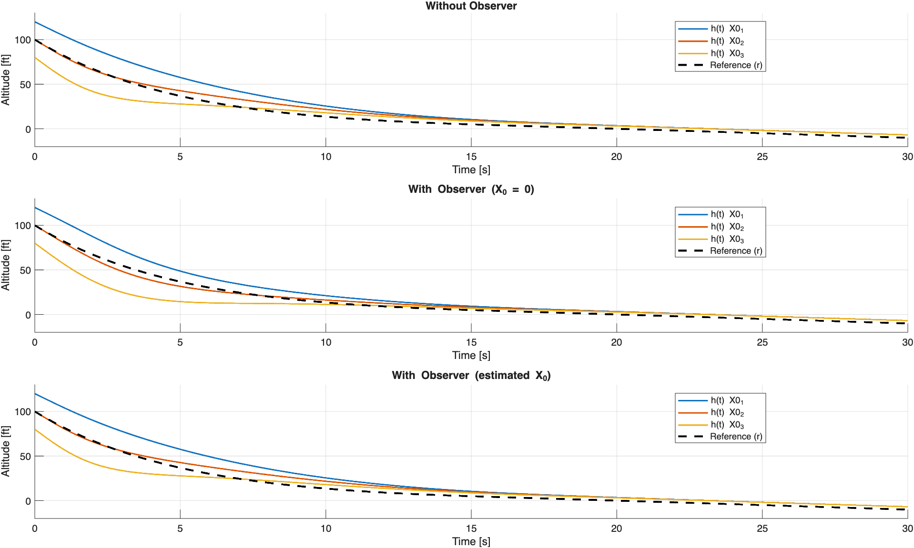
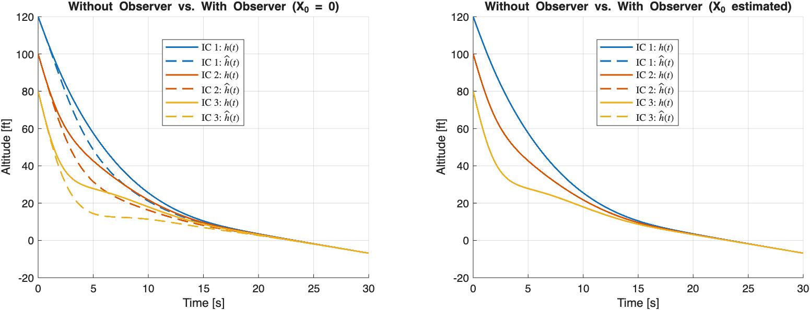
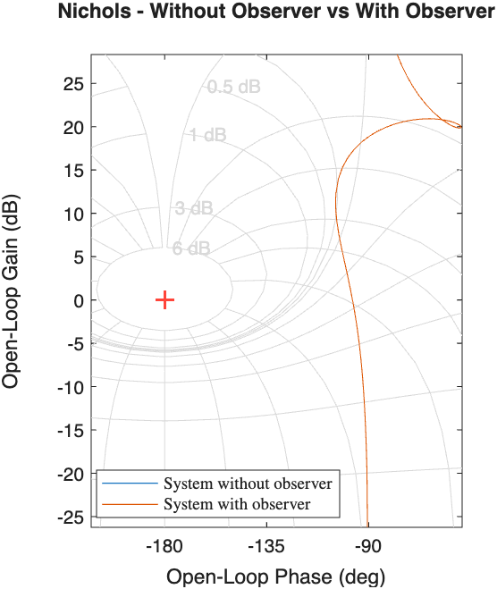
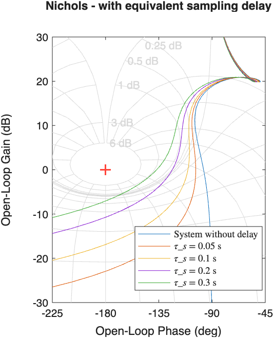
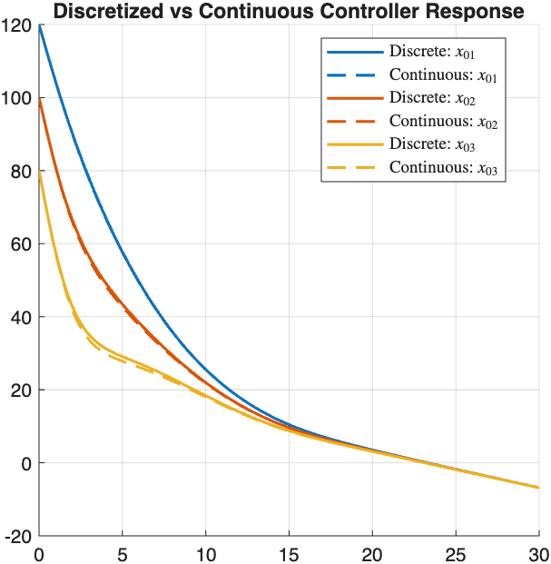

# Aircraft Landing Flare Control with LQR and Reduced-Order Observer

> [!NOTE]
> This is an academic project developed for Control Systems course at ITA (Instituto Tecnológico de Aeronáutica). It is not a real aircraft controller, it is an educational exercise exploring practical implementation issues in control design using a simplified linearized model.

This project designs, analyzes, and simulates a feedback controller for the final flare phase of an aircraft landing. The goal is to design a control law to guide an aircraft from 80–120 ft to touchdown, given linearized longitudinal dynamics with elevator deflection as input. It was developed and focuses on practical implementation issues such as observer initialization, sampled-data effects, and discrete controller simulation.

## Project Scope

- Design an LQR state-feedback gain for the longitudinal aircraft model.
- Simulate the landing flare response for three different initial conditions.
- Build a reduced-order observer when climb rate is not directly measured.
- Compare ideal full-state feedback against observer-based feedback.
- Analyze equivalent loop behavior with Nichols charts.
- Select a sampling period using pole-speed and equivalent delay arguments.
- Simulate the discretized observer-based controller in Simulink.

## System Model

The state vector is:

```text
x = [q, Delta theta, h_dot, h]^T
```

where `q` is pitch rate, `Delta theta` is pitch-angle variation, `h_dot` is climb rate, and `h` is altitude. The control input is the elevator deflection:

```text
u = Δδ  (elevator deflection increment from trim)
```

The continuous-time dynamics are:

```text
x_dot = A x + B u
```

with:

```text
A = [-0.6  -0.76   0    0
      1     0      0    0
      0   102.4   -0.4  0
      0     0      1    0]

B = [-2.375
      0
      0
      0]
```

The desired landing flare altitude is:

```text
h_d(t) = 100 exp(-t/5),  0 <= t <= 15
h_d(t) = 20 - t,         t > 15
```

## Control Law

The implemented controller follows:

```text
u = -K1 x1 - K2 x2 - K3 (x3 - h_dot_d) - K4 (x4 - h_d)
```

The LQR design uses:

```text
Q = diag([1.6^2, 1.6^2, 1e-4, 1e-5])
R = 1
```

The reduced-order observer estimates the unmeasured climb-rate state and is initialized in two ways:

- zero initial estimate, to show the transient caused by estimation error;
- improved estimate based on the relationship between pitch angle and climb rate.

## Results

### Altitude Response — Full State Feedback, Observer (X₀ = 0), and Observer (Estimated X₀)

Three subplots comparing altitude tracking across the three initial conditions, with and without the reduced-order observer. Zero initialization causes a visible transient; the improved initialization closely matches full-state feedback.



---

### Full State Feedback vs Observer — Side-by-Side Comparison

Direct overlay of actual vs estimated altitude for each initial condition. The left panel shows the degraded response with zero observer initialization; the right panel shows the improvement with estimated initialization.



---

### Nichols Chart — State Feedback vs Observer-Based

The two loop shapes nearly overlap, consistent with the separation principle: adding the observer does not significantly alter the open-loop frequency response or the stability margins.



---

### Nichols Chart — Sampling Period Selection via Equivalent Delay

The equivalent delay `e^(-sT/2)` is used to assess the impact of discretization on the loop shape. As the sampling period increases, the loop curve shifts left on the Nichols chart, eroding phase margin. `Ts = 0.2 s` is selected as the largest period that keeps the loop shape acceptably close to the continuous-time baseline.



---

### Discrete vs Continuous Controller Response (Simulink)

The discretized observer-based controller (`Ts = 0.2 s`) is simulated in Simulink for the three initial conditions. Discrete and continuous responses are nearly indistinguishable, validating the sampling period choice. The Simulink model (`DiscreteControllerR2024.slx`) implements the full discrete loop — ZOH plant, discrete observer, and discrete state-feedback gain — and was saved for compatibility with MATLAB/Simulink R2024a.



---

## Requirements

- MATLAB
- Simulink
- Control System Toolbox

The Simulink model was prepared for MATLAB/Simulink R2024a compatibility.

## How to Run

1. Open MATLAB in the repository root.
2. Open `aircraft_flare_lqr_observer.mlx`.
3. Run the Live Script sections in order.
4. Keep `DiscreteControllerR2024.slx` in the same folder or on the MATLAB path before running the discrete-controller simulation section.

The Live Script generates the continuous-time responses, observer comparisons, Nichols plots, and the final continuous-vs-discrete simulation comparison.

## Key Results

- The plant is controllable, allowing LQR state-feedback design.
- Full-state feedback tracks the landing flare reference for all three initial conditions.
- A reduced-order observer recovers the unmeasured climb-rate state, but zero initialization introduces a visible transient in the early phase of the maneuver.
- Initializing the observer with an estimate derived from the pitch angle substantially eliminates that transient.
- Nichols plots for full-state feedback and observer-based feedback nearly overlap, consistent with the separation principle.
- Equivalent delay analysis on the Nichols chart justifies `Ts = 0.2 s` as the sampling period — fast enough relative to the dominant dynamics while preserving acceptable gain and phase margins.
- The discretized Simulink simulation confirms that continuous and discrete responses are nearly indistinguishable at the chosen sampling rate.
